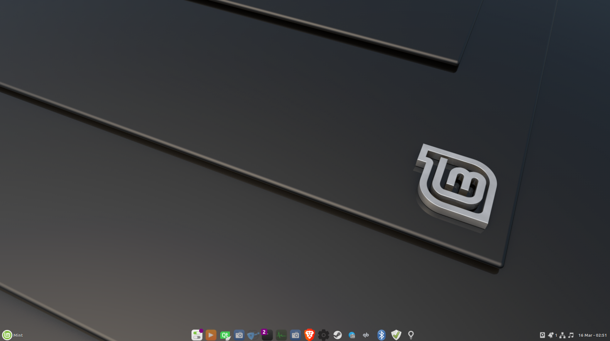
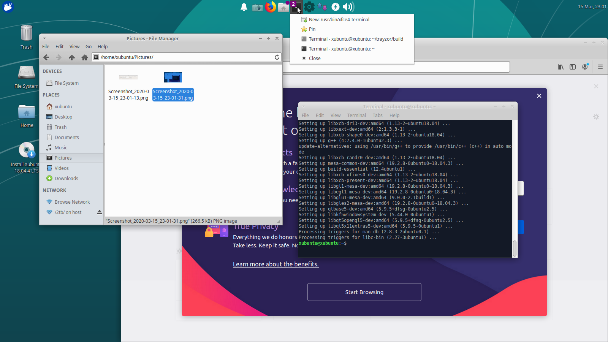
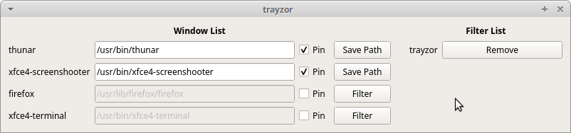
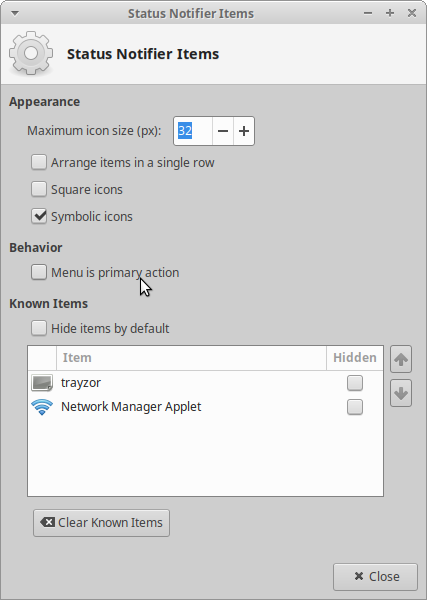
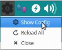

# Trayzor (alpha)

### Screenshot on Linux Mint LMDE4:


### Screenshot on Xubuntu 18.04 LiveCD:


Shows a taskbar in your system tray.
- left click:
  - on main icon (gear) toggle settings dialog
  - with 1 window open 
    - if active toggle minimize/restore
    - if not active activates window
  - with 2 or more windows cycles through them
  - with no window open (pinned icon) launches new instance

- middle click launches new instance
- right click shows context menu

### Settings:
- pin icons
- edit path (for pinned icons)
- filter windows



## Instructions:

Can be run or built from a LiveCD for testing.

#### Make sure "Menu is primary action" is disabled (on XFCE, or some equivalent functionality in your current tray applet):


#### Run:
```
# Built on Xubuntu 18.04 (needs qt libs 5.9.5 or higher)
# installing libkf5windowsystem5 should pull all required libs

# install dependencies
sudo apt install -y git libkf5windowsystem5

# clone repo and cd into build folder
git clone https://github.com/slidinghotdog/trayzor.git && cd trayzor/build

# make it executable and run
chmod +x ./trayzor
./trayzor

```

#### or Build:

```
# install dependencies
sudo apt install -y git build-essential qt5-qmake libkf5windowsystem-dev qt5x11extras5-dev

# clone repo and cd into project folder
git clone https://github.com/slidinghotdog/trayzor.git && cd trayzor

# clean files and build
rm ./build/*
cd build
qmake -qt=qt5 .. && make

# run (from build directory)
./trayzor
```

#### Hiding dialog window: need to open config from context menu with config already open (reloads the list without closing the dialog)

